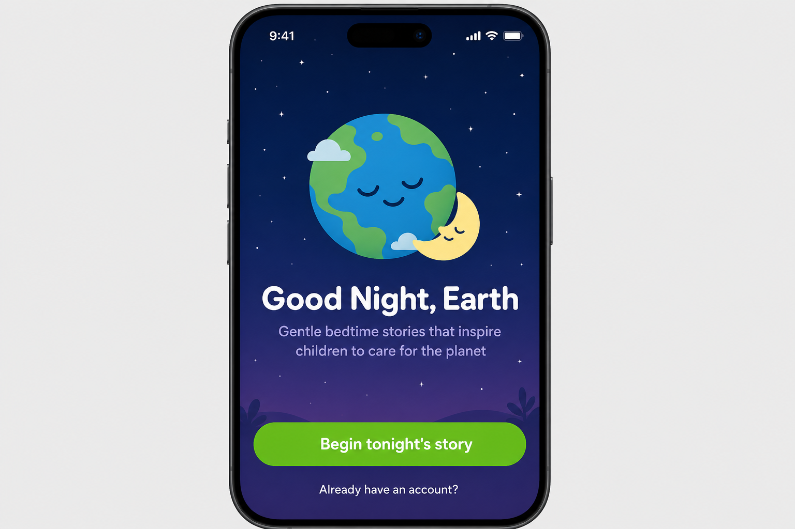
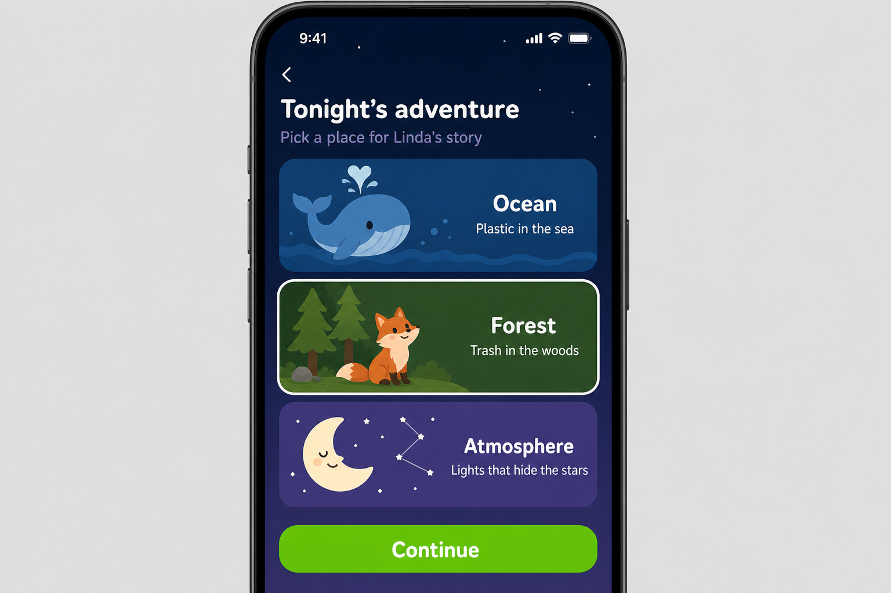
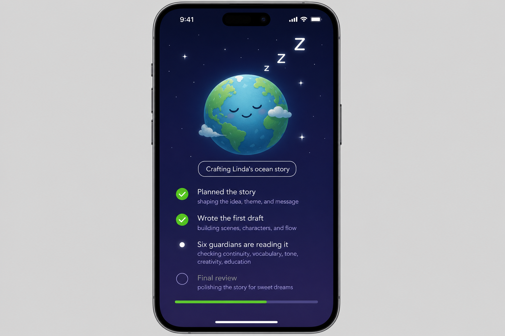
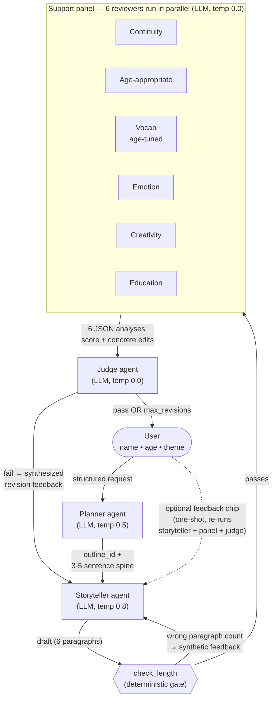

# Hippocratic AI Coding Assignment
Welcome to the [Hippocratic AI](https://www.hippocraticai.com) coding assignment

## Instructions
The attached code is a simple python script skeleton. Your goal is to take any simple bedtime story request and use prompting to tell a story appropriate for ages 5 to 10.
- Incorporate a LLM judge to improve the quality of the story
- Provide a block diagram of the system you create that illustrates the flow of the prompts and the interaction between judge, storyteller, user, and any other components you add
- Do not change the openAI model that is being used. 
- Please use your own openAI key, but do not include it in your final submission.
- Otherwise, you may change any code you like or add any files

---

## Rules
- This assignment is open-ended
- You may use any resources you like with the following restrictions
   - They must be resources that would be available to you if you worked here (so no other humans, no closed AIs, no unlicensed code, etc.)
   - Allowed resources include but not limited to Stack overflow, random blogs, chatGPT et al
   - You have to be able to explain how the code works, even if chatGPT wrote it
- DO NOT PUSH THE API KEY TO GITHUB. OpenAI will automatically delete it

---

## What does "tell a story" mean?
It should be appropriate for ages 5-10. Other than that it's up to you. Here are some ideas to help get the brain-juices flowing!
- Use story arcs to tell better stories
- Allow the user to provide feedback or request changes
- Categorize the request and use a tailored generation strategy for each category

---

## How will I be evaluated
Good question. We want to know the following:
- The efficacy of the system you design to create a good story
- Are you comfortable using and writing a python script
- What kinds of prompting strategies and agent design strategies do you use
- Are the stories your tool creates good?
- Can you understand and deconstruct a problem
- Can you operate in an open-ended environment
- Can you surprise us

---

## Other FAQs
- How long should I spend on this? 
No more than 2-3 hours
- Can I change what the input is? 
Sure
- How long should the story be?
You decide

---

## Good Night, Earth

*Gentle bedtime stories that inspire children to care for the planet.*

<p align="center">
  
  
  
</p>

<p align="center"><sub>Design references: welcome, theme picker, and generating screens. The desktop UI in <a href="static/index.html">static/index.html</a> uses the same visual system (deep night-sky palette, SF Pro Rounded type, single Duolingo-green accent, recurring sleeping-Earth mascot).</sub></p>

A multi-agent pipeline. The user's structured request first goes to a
**story planner** that picks one of two narrative outlines
(`mistake_and_amends` or `witness_and_explain`) and drafts a 3-5 sentence
story spine. The **storyteller** renders that spine into a six-paragraph
bedtime story, the draft is reviewed in parallel by a **panel of six
specialist agents** (continuity, age_appropriateness, vocab tuned to the
listener's age, emotion, creativity, education), the **judge** weighs the
story together with the panel's
findings and emits a single verdict, and if the verdict fails the
storyteller revises with the judge's synthesized feedback. All agents use
`gpt-3.5-turbo` (per the rules); only their system prompts and
temperatures differ.

### Block diagram

Edges are labeled with what flows between components - the structured
input that fills each agent's user-template, or the structured output it
returns. Every solid arrow is part of the main pipeline; the dashed
arrow is the optional one-shot user feedback loop.



The outer flow is strictly sequential and easy to trace. Parallelism only
appears at the support panel, implemented as one
`ThreadPoolExecutor.map(...)` call. The bounded `for` loop in
`run_pipeline` always terminates: the judge either passes the draft, or
`max_revisions` is reached and the last draft is delivered with the
judge's reasoning attached. The dashed user-feedback arrow runs at most
once per session and goes through the same panel + judge bar before
replacing the original.

### Pass criterion

A draft passes when the judge's overall score is at least `JUDGE_PASS_SCORE`
(default 4 / 5) **and** the judge raises no safety concerns. Support agent
scores are inputs to the judge prompt and are surfaced in `--verbose` for
transparency, but the judge owns the gate. We trust-but-verify: even if the
judge declares `pass=true`, we enforce the threshold and zero-safety rule
in code so a lenient verdict can't slip through.

### Code layout

| File | Purpose |
|------|---------|
| [main.py](main.py) | Thin CLI: argparse, env validation, logging configuration, assignment reflection |
| [story_engine.py](story_engine.py) | Dataclasses, `plan_story`, `generate_story`, `run_support_agents` (parallel), `judge_story`, `run_pipeline`, `apply_user_feedback`, JSON parsing |
| [prompts.py](prompts.py) | Planner, storyteller, parametrized support-agent template, judge prompts, `USER_FEEDBACK_PRESETS`; `OUTLINE_TYPES`, `ENVIRONMENT_FACTS`, `ENVIRONMENT_CONCERNS` data |
| [webapp.py](webapp.py) | FastAPI server: thin JSON wrapper around the pipeline + static mount for the desktop UI |
| [static/index.html](static/index.html) | Single-page desktop UI: welcome, listener setup, theme picker, generating animation, story view, feedback chips |
| [client.py](client.py) | Single `chat()` wrapper around `openai.ChatCompletion.create`; one-time `.env` load |
| [config.py](config.py) | Model id, temperatures, token budgets, revision cap, pass threshold |

### Setup

```bash
python -m venv venv
source venv/bin/activate
pip install -r requirements.txt
echo "OPENAI_API_KEY=sk-..." > .env   # gitignored, never committed
```

### Run

The CLI takes three structured inputs: the listener's first name, their age
(5-10), and an environmental theme from a curated list. Each is independently
optional - any flag you omit is asked for interactively.

```bash
# Fully interactive: prompts for name, age, and environment in order
python main.py

# Non-interactive, with panel + judge transparency on stderr
python main.py --name "Aria" --age 7 --environment ocean --verbose

# Allow up to 3 revisions
python main.py --name "Theo" --age 9 --environment forest --max-revisions 3
```

`--environment` accepts one of: `ocean`, `forest`, `atmosphere`.
Each topic ships with both a small "facts pack" and a real-world topic
name (defined in [prompts.py](prompts.py) as `ENVIRONMENT_FACTS` and
`ENVIRONMENT_CONCERNS`). For each story the planner picks one of two
narrative outlines and drafts a brief spine; the storyteller renders that
spine into a six-paragraph bedtime arc. The story can name the topic
directly in age-appropriate language ("plastic in the ocean", "the planet
slowly getting warmer", "lights that hide the stars"), the main character
takes a clear, child-scaled action that resolves the conflict, and the
ending still settles the listener toward sleep. Each story ends with the
listener feeling calm AND able to imagine taking the same small action
themselves.

The story is printed to stdout. With `--verbose`, the panel's per-aspect
scores, the judge's verdict, and any synthesized feedback for the next
revision are streamed to stderr so you can see how the loop converged.

### Run the desktop UI

A small FastAPI server in [webapp.py](webapp.py) wraps the same pipeline
and serves a single-page desktop UI from [static/index.html](static/index.html).
The UI walks through welcome -> listener setup -> theme picker -> a
calming generating animation -> the rendered story, with a row of
feedback chips at the bottom (Make it gentler / More magical / Shorter /
Different ending / It's perfect). Picking a chip triggers one
storyteller revision plus a full panel + judge re-run; if the revised
version passes the same bar as the main loop it replaces the original,
otherwise the original stays and a soft notice explains why.

```bash
source venv/bin/activate
pip install -r requirements.txt   # adds fastapi + uvicorn
uvicorn webapp:app --reload
```

Then open <http://127.0.0.1:8000> in a desktop browser.

The visual design pulls from two sources: Apple's discipline (SF Pro
Rounded, generous whitespace, deep night-sky palette, restrained accent
color) and Duolingo's warmth (a recurring sleeping-Earth mascot, a
single bright Duolingo green for primary actions, big friendly cards for
the theme picker). See the inline mockups at the top of this section
for design references.

### Cost note

Per request, the pipeline issues 1 planner + 1 storyteller + 6 support +
1 judge = 9 LLM calls (the planner runs once and its spine is reused
across revisions). Each quality revision adds up to 8 more, with one
wrinkle: a deterministic length gate ([check_length](story_engine.py))
runs before the panel, so drafts with the wrong paragraph count revise
from a code-generated feedback string and skip the panel + judge
entirely - a length-failed revision costs **1 call** instead of 8. At
default `--max-revisions 2` the absolute worst case is 25 calls; in
practice it lands lower. If the user picks a desktop-UI feedback chip,
that adds another 1 storyteller + 6 support + 1 judge = 8 calls (single
shot), only if they opt in. All on `gpt-3.5-turbo`, so a few cents and
a few seconds at most, but worth knowing if you batch-run it.